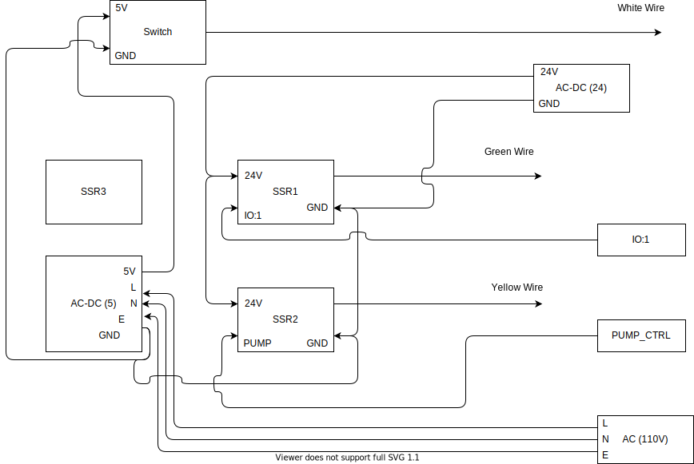

# Auto Adhesive Dispenser

This Project is used to create a control pad and scale to dispense adhesive until a weight limit is reached. E3 Displays uses various manufacturing processes when fabricating the customized display stacks for its customers. One of these processes involves using precise amounts of adhesive for bonding displays to cover glass. In the past, this has been a manual process, requiring operators to spend large amounts of time preparing the adhesive for the bonding process. This project automates this by bundling all the prep work into one location, controlled electronically.

## Video Demonstration
[](https://www.youtube.com/watch?v=TZbIzYgnOPE)

## Operation Instructions

The full operation instructions can be located [here](/docs/Operation_Instructions.docx)

### Transition Diagram

<div style="background-color:white">

</div>

## External Libraries used:

- EEPROM.h
- Keypad.h
- Wire.h
- LiquidCrystal_I2c.h
- HX711.h

## Schematic:


## Hardware Layout:

<div style="background-color:white">

</div>

## Development tools

- Download [Arduino IDE](https://www.arduino.cc/en/software)
- Download [Visual Studio Code](https://code.visualstudio.com/download) (VS code)
- Open VS code and click on the Extensions button on left nav bar (Ctrl+Shift+X)
- Search for PlatformIO IDE and install the extension
- Use [git bash](https://git-scm.com/downloads) or [wsl](https://docs.microsoft.com/en-us/windows/wsl/install-win10) to pull from this repository to your local machine
  - see [GitHub documentation](https://docs.github.com/en/free-pro-team@latest/github/creating-cloning-and-archiving-repositories/cloning-a-repository) for more information
  - if you don't have the repository on your computer use:
    - `git clone https://github.com/MArndt26/E3-Auto-Dispenser.git`
  - if the repository is already on your computer update it to the lastest version with:
    - `git pull origin`
- Open VS Code and open the project directory
  - File -> Open Folder
- Wait for ProjectIO to initialize and then press the [->] upload button to reprogram the device

## Calibration Procedure

- Go to main.h and check the calibration password `CALIBRATION_PASSWORD`
  - note that you can change the password by editing this value and updating the firmware via the USB programming port
- Once on the Calibration Screen follow the following instructions:

  - Remove all weight from scale
  - Tare scale (`D` button)
  - Place known weight on scale
  - Pressing the following buttons will add/subtract the given value from the calibration factor
    ```
    1, 2, 3, A --> calibration factor += 0.1, 1, 10, 100
    4, 5, 6, B --> calibration factor -= 0.1, 1, 10, 100
    ```
  - Using the instructions above manipulate the calibration factor until the known value matches the displayed value

## Resources/Inspiration:

### Load Cell:

- https://www.instructables.com/id/Arduino-Bathroom-Scale-With-50-Kg-Load-Cells-and-H/
- https://create.arduino.cc/projecthub/Fedeasche/arduino-uno-high-precision-counting-scale-3f484b
- https://github.com/bogde/HX711

### Keypad:

- https://www.circuitbasics.com/how-to-set-up-a-keypad-on-an-arduino/

### Display:

- https://www.makerguides.com/character-i2c-lcd-arduino-tutorial/
- https://maxpromer.github.io/LCD-Character-Creator/
- http://avtanski.net/projects/lcd/

## TODO:

- [x] Digitally filter/smooth scale data
- [x] Test with Hardware
- [ ] Change all String variables to char arrays
- [ ] Only update display when text has changed for performance update
